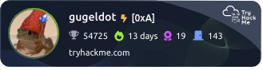
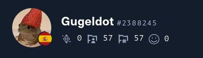

## Hi there 🐥 :octocat:

  
  

## Projects
- 🚀[**Gugeldots Site**](https://gugeldot.github.io/gugeldots-site/)  
    - Project to learn HTML, CSS, JavaScript and GitHub API

- 🎮[**SLYS Web**](https://gugeldot.github.io/slys-web/)  
    - SLYS is a lightweight tool that securely fragments and encrypts your files — no cloud, no noise, just pure privacy.

    - Built in Rust & Flutter

## Statistics

  

